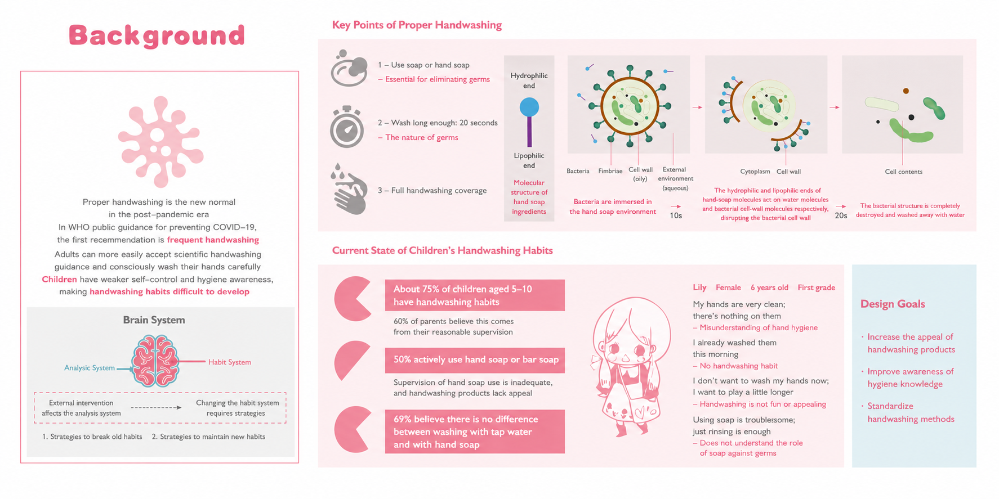
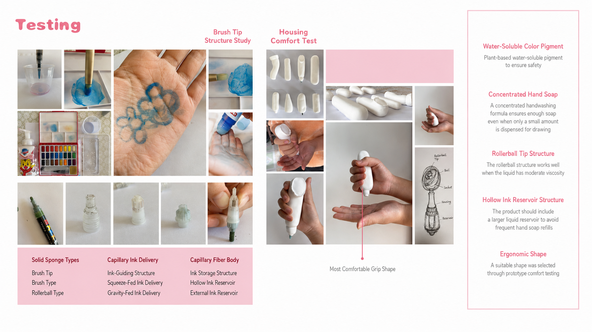
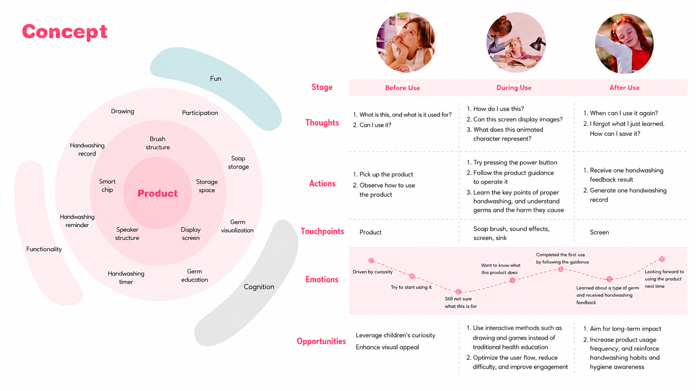
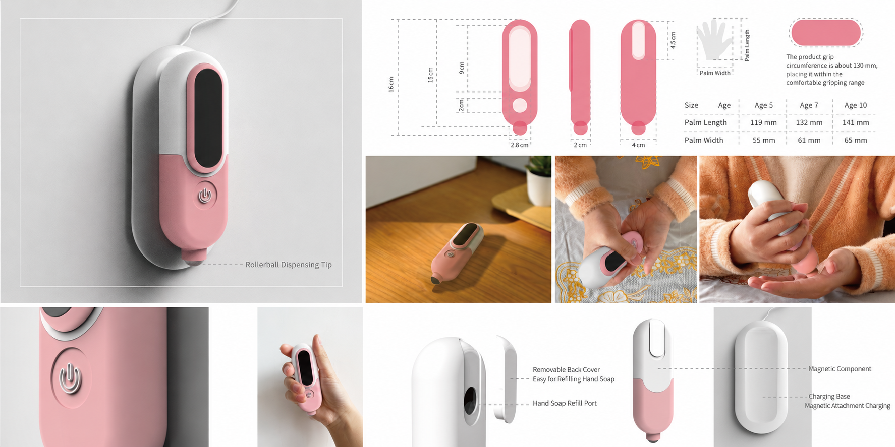
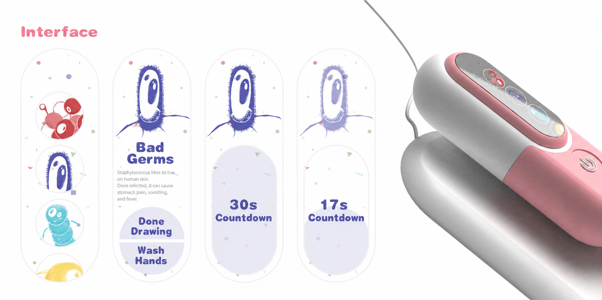

**Independent portfolio project · Mar – Apr 2021**

## Problem

Reading hand-washing failure in young children through a behavior-change lens, I framed it around three everyday failure modes:

- **Low motivation** to start
- **High ability-side friction** for small hands
- **Weak in-context prompts** at the moment of use

## Research

Applied product-design research methods to investigate where each failure mode actually surfaces:

- **User persona** of children aged 5–10 and their parents
- **3-stage user journey mapping** — pre / during / post-use
- **Competitive analysis** of 11 peer products across 4 design dimensions (form factor · hygiene affordances · engagement loop · parent-side cues)
- **Iterative material testing** of pen-tip structures and liquid-soap formulations

My analysis surfaced a recurring observation that anchored the final design:

> Children's incomplete washing was rarely about willingness — it was about the absence of a salient cue to **stop**, not to start.

## Concept

The design concept responds to each failure mode with one behavior-change lever:

- The **cartoon-painting layer** is designed to reframe washing as a *play motivation*.
- The **pen-tip geometry and liquid-soap formulation** were iterated through physical material testing specifically to lower friction for small hands.
- The **wall-mount dock** is positioned as a *contextual prompt* — tying the behavior to a fixed bathroom location and a finishable countdown.

## Outcome

