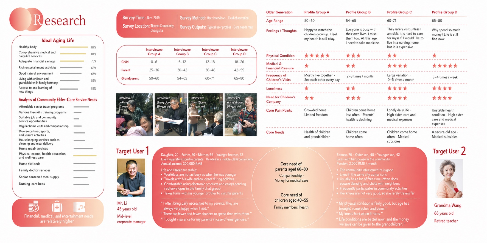
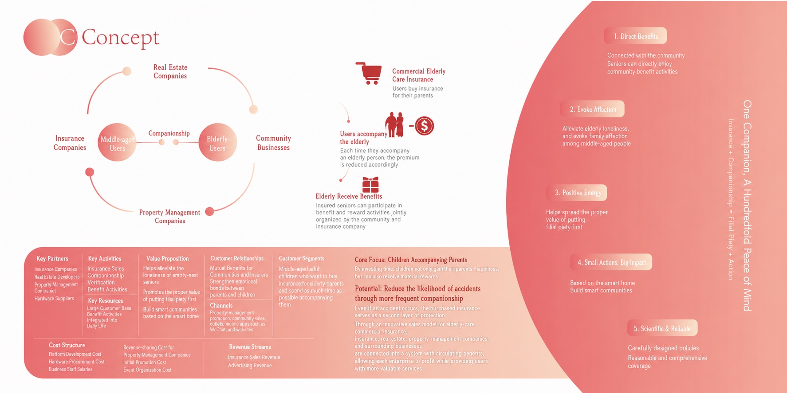
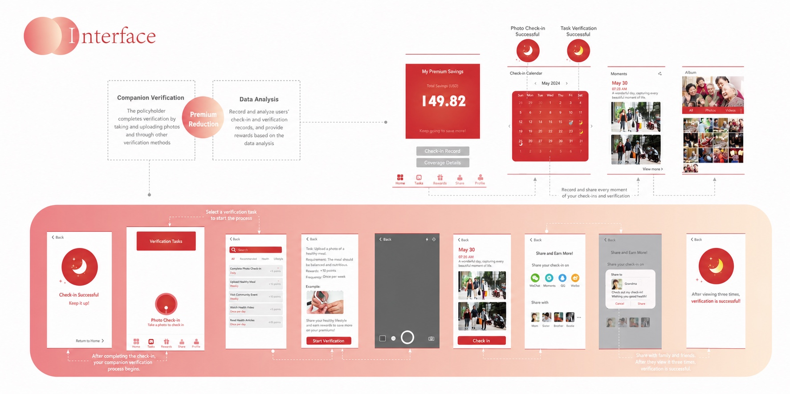

**Service Design & Business · 5-person team · 2021**

A research-informed service design project investigating how to sustain meaningful contact between urban adult children and their elderly parents (age 60–75) — a relationship our user research surfaced as strained by physical distance, asymmetric communication preferences, and the absence of low-friction coordination tools. The team designed a service concept that bridges adult children, elderly parents, insurance providers, and community partners, pairing a companionship-record app with a premium-reduction mechanism that would tie insurance economics to sustained intergenerational interaction.

## Method

- **10 user interviews** across both generations — surfacing different framings of "care" (rational concern vs emotional reassurance) and the everyday gestures each side counted as contact
- **Stakeholder mapping** of the 4-actor system (adult children · elderly parents · insurance providers · community partners), tracing incentive alignments and points of friction
- **User-needs quadrant analysis** along two axes (rational / emotional × younger / elder generation) to position unmet needs and design space
- **Competitive analysis** of 4 peer products in the elder-care service space

## Findings

Our analysis surfaced an asymmetry that anchored the design: adult children and elderly parents were each willing to invest in the relationship, but neither side had a low-friction way to translate willingness into visible, repeated action. Existing solutions in our competitive scan tended to either over-burden one side (interfaces ill-suited to elderly users) or stay too generic to scaffold the specific moments of contact families actually want.

## Outcome

A service concept organized around three coordinated artifacts:

- **Companionship-record app concept** — designed to capture light intergenerational contact across messaging, voice calls, and visits, with prompts calibrated to each generation's habits
- **Premium-reduction mechanism (proposed)** — would tie accumulated companionship records to elder-care insurance premiums, providing an external economic anchor neither generation has to impose on the other
- **Four-flow service blueprint** — mapping human / information / cash / material flows across all 4 stakeholder groups, plus a storyboarded user journey at three key contact moments

---

This was my first design engagement with **family-side coordination across asymmetric generational needs** — designing not for one user but for a relationship across generations. The relationship geometry here (adult children ↔ elderly parents) differs from the adolescent–parent dynamic I now study, but the methodological habit — taking family as the unit of design and noticing where willingness fails to translate into low-friction action — carries over directly into a doctoral direction on AI mediation in adolescent–parent communication.
